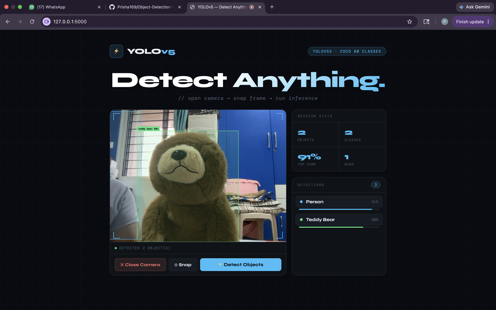

Object Detection Web App

Project Overview

A web-based object detection system built using YOLOv5, Flask, and a custom frontend. The application allows users to access their webcam, capture an image, and perform object detection on the captured frame.

Features

- Webcam access through browser
- Capture image directly from camera
- Object detection using YOLOv5
- Detection result visualization
- Simple and interactive web interface

Technologies Used

- Python
- Flask
- YOLOv5
- PyTorch
- HTML
- CSS
- JavaScript

My Contribution

- Designed and developed the frontend interface
- Integrated webcam capture functionality
- Connected frontend with the YOLOv5 detection pipeline
- Implemented result display and user interaction features

How It Works

1. Open the web application
2. Allow camera access
3. Capture an image using the webcam
4. Submit the image for detection
5. View detected objects and results

Running the Project

Install Dependencies

pip3 install -r requirements.txt

Start the Application

python3 app.py

Open in Browser

http://127.0.0.1:5000

Future Improvements

- Live video object detection
- Support for custom-trained models
- Mobile-friendly interface
- Cloud deployment
  
